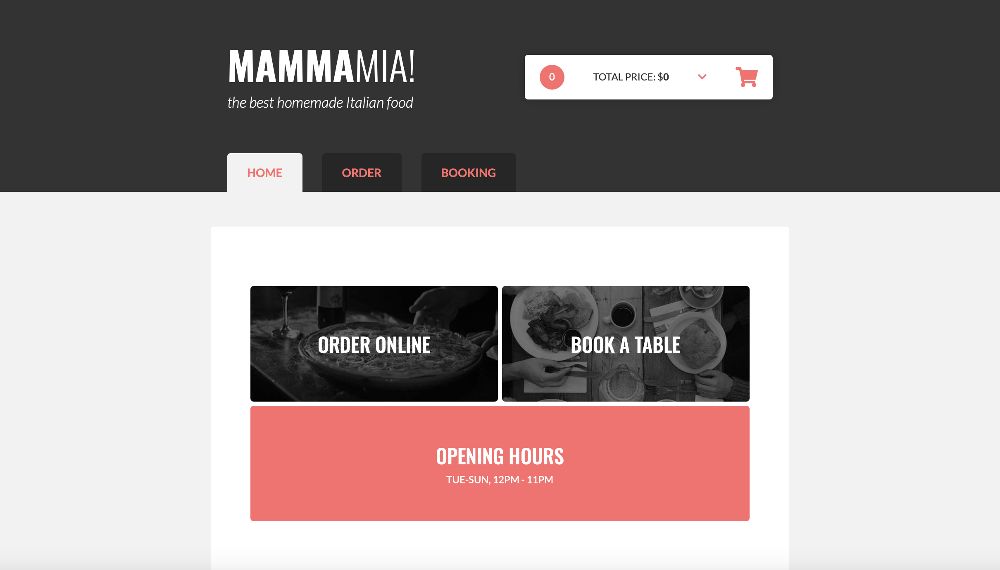

# Project Pizzeria

## Description

This project is a Single Page Application (SPA) for a pizzeria website. It features a home section that promotes the pizzeria, provides information about it, and includes customer comments. The order section displays products fetched from a database, allowing users to configure and order pizzas and other dishes from home. The booking section enables users to book a table for a specific date and time that is available. Additionally, the application includes a cart where users can add products, customize them, and place orders.

## Features

- Home Section: Promotes the pizzeria and provides information and customer comments.
- Order Section: Displays products from the database, allows configuration and ordering of pizzas and other dishes.
- Booking Section: Enables table reservations for available dates and times.
- Cart: Add products, customize them, and place orders.

## Demo

If you want to see the project in action, you can visit the [pizzeria-project](https://project-pizzeria-tff9.onrender.com).

## Technologies

The project uses the following technologies:

- HTML
- SCSS
- JavaScript
- Handlebars
- Json-server
